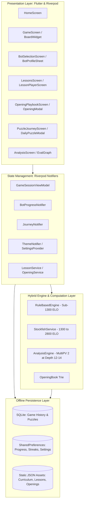
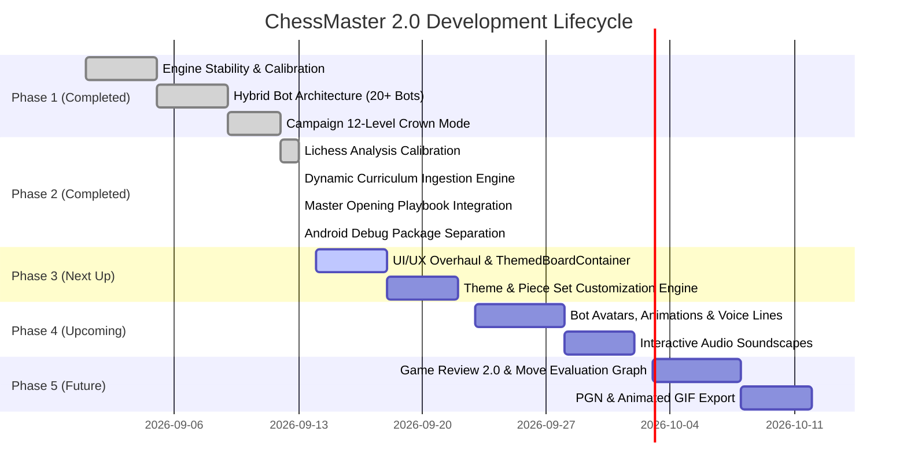

# ChessMaster 2.0: Master Architecture & Product Execution Plan

> **Document Version:** 2.0.0  
> **Status:** Active Reference & Roadmap  
> **Target Platforms:** Android & iOS (100% Offline-First)  
> **Package Identifier:** `com.karna.chessmaster` (Debug: `com.karna.chessmaster.debug`)  
> **Last Updated:** September 2026  

---

## 1. Executive Summary & Vision

**ChessMaster 2.0** is an uncompromising, high-performance, **100% offline-first** chess learning and play platform designed for mobile devices. Unlike mainstream competitors (such as Chess.com and Lichess apps) that offload engine evaluation, puzzle fetching, lessons, and bot play to cloud servers, ChessMaster 2.0 executes **every single calculation locally on-device**.

### Key Value Pillars
1. **Zero-Latency Offline Play**: Seamless, battery-efficient gameplay with no network roundtrips, no accounts, and no paywalls.
2. **20+ Distinct Bot Personalities**: Ranging from 400 ELO beginners to 2800 ELO Grandmasters, driven by a hybrid engine architecture that mimics authentic human blunders, tactical styles, and opening preferences.
3. **12-Level Master Campaign**: A structured progression system with 3-star crown masteries, dynamic piece handicaps, and milestone boss battles.
4. **Lichess-Calibrated Game Analysis**: Exact mathematical alignment with Lichess evaluation models using non-linear Win-Probability ($\Delta\text{Win\%}$) loss rather than naive Centipawn Loss, accompanied by opening book blunder immunity.
5. **30+ Category Offline Lessons Curriculum**: Zero hardcoded positions in application code; a rich, multi-tier JSON-driven curriculum parsed from master study databases featuring interactive step validation, automated opponent responses, and tactical principle breakdowns.
6. **Master Opening Playbook**: 34+ top openings with interactive ply-by-ply exploration, dynamic opening trie recognition, and one-tap transition into bot practice sessions.
7. **1,000-Puzzle Journey & Retention Engine**: 1-based progressive tactical journey, deterministic daily puzzles, streak heatmaps, and freeze protection tokens.
8. **Scalable Theme & Piece Design System**: Shared container abstractions (`ThemedBoardContainer`), modular board themes, and vector piece sets.

---

## 2. System Architecture & Tech Stack



### Technology Matrix
- **Framework**: Flutter 3.x / Dart (Sound Null Safety)
- **State Management**: Flutter Riverpod (`StateNotifierProvider`, immutable states)
- **Chess Domain Logic**: `chess` package (board state, FEN, SAN/LAN parsing, legal move generation)
- **Native Engines**:
  - Embedded Stockfish (UCI engine compiled for ARM64/x86_64 via Flutter Stockfish plugin)
  - Custom Pure-Dart `RuleBasedEngine` for low-ELO human emulation
- **Persistence**: `sqflite` for high-volume relational records (puzzles, game history); `shared_preferences` for quick key-value persistence (unlocks, stars, streaks).
- **Audio & Haptics**: `audioplayers` for crisp sound effects (move, capture, check, victory); `vibration` for tactile feedback.

---

## 3. Bot Ecosystem & Master Campaign

### 3.1 Dual-Engine Architecture
A major flaw in mobile chess apps is relying exclusively on Stockfish down to low ratings (e.g. 400-1000 ELO). Stockfish throttled to low skill levels does not play like a beginner; it plays like a grandmaster for 4 moves and then deliberately drops a Queen in an unnatural, robotic fashion.

To solve this, ChessMaster 2.0 utilizes a **Hybrid Dual-Engine Architecture**:

```
                              [ Target ELO ]
                                    |
            +-----------------------+-----------------------+
            | < 1300 ELO                                    | >= 1300 ELO
            v                                               v
   [ RuleBasedEngine ]                             [ StockfishService ]
   - Human-like heuristics                         - UCI_LimitStrength = true
   - Configurable blunder rates                    - UCI_Elo = Target ELO
   - Tactical tunnel vision                        - Skill Level & Depth clamped
   - Organic human think times                     - Multi-threaded search
```

1. **Sub-1300 ELO (`RuleBasedEngine`)**:
   - Implements authentic human weaknesses: hanging pieces, failing to spot long-range diagonal threats, greedily grabbing poisoned pawns, and missing pins.
   - Distinct personality traits: aggression score (prefers attacking moves over quiet positional development), blunder probability per ply, and tactical search horizon (1 to 3 plies).
2. **1300 to 2800 ELO (`StockfishService`)**:
   - Calibrated via UCI protocol:
     - `setoption name UCI_LimitStrength value true`
     - `setoption name UCI_Elo value [Target Elo]`
     - Search depth clamped according to level (e.g. Depth 5 at 1500 ELO, Depth 18+ at 2600 ELO).
     - Artificial think delay (300ms–1500ms) to emulate human deliberation and prevent instantaneous machine responses.

### 3.2 20+ Bot Personalities
The app features over 20 unique bot personalities divided across four tiers:

| Tier | Bot Name | ELO | Engine Type | Playstyle & Trait |
| :--- | :--- | :--- | :--- | :--- |
| **Novice** (400–1000) | **Pawn Pusher Pete** | 450 | Rule-Based | Pushes flank pawns; frequently misses hanging pieces. |
| | **Speedy Sam** | 600 | Rule-Based | Fast responses; hyper-aggressive; over-extends pieces early. |
| | **Cautious Clara** | 750 | Rule-Based | Defensive turtle; avoids trading pieces even when favorable. |
| | **Greedy George** | 900 | Rule-Based | Takes any free piece regardless of tactical consequences. |
| | **Careless Carl** | 1000 | Rule-Based | Solid opening repertoire; blunders under queen tension. |
| **Club** (1100–1500) | **Tactical Tim** | 1150 | Rule-Based | Looks for checks and forks; vulnerable to quiet counter-moves. |
| | **Solid Sarah** | 1300 | Stockfish (Calibrated) | Disciplined opening principles; rarely blunders single-move tactics. |
| | **Aggressive Alex** | 1400 | Stockfish (Calibrated) | Gambiteer; pushes kingside pawns for sharp attacks. |
| | **Positional Pete** | 1500 | Stockfish (Calibrated) | Focuses on outposts and open files; avoids tactical risks. |
| **Advanced** (1600–2100) | **Sharp Sofia** | 1650 | Stockfish (Calibrated) | Expert in Sicilian & King's Indian; lethal with initiatives. |
| | **Resilient Ryan** | 1800 | Stockfish (Calibrated) | Tenacious defender; counter-attacks from cramped positions. |
| | **Dr. Endgame** | 1950 | Stockfish (Calibrated) | Rushes to trades; virtually flawless endgame technique. |
| | **Master Maya** | 2100 | Stockfish (Calibrated) | Master candidate; deep opening knowledge and tactical accuracy. |
| **Master / GM** (2200–2800) | **International Ivan**| 2300 | Stockfish (Calibrated) | FIDE Master level; exploits positional pawn weaknesses mercilessly. |
| | **Grandmaster Gary** | 2500 | Stockfish (Calibrated) | Universal playstyle; calculation depth 14+; lethal precision. |
| | **The Queen's Champion**| 2650 | Stockfish (Calibrated) | Dynamic positional genius; master of initiative and sacrifices. |
| | **Stockfish Titan** | 2800+ | Stockfish (Uncapped) | Maximum engine depth; uncapped UCI strength; zero blunders. |

### 3.3 12-Level Master Campaign & Crown System
The campaign mode organizes progression into 12 structured tiers with clear mastery benchmarks:
- **Unlock Gates**: Level $N+1$ unlocks only upon winning Level $N$.
- **Crown Mastery (0 to 3 Stars per Level)**:
  - $\star$ **1 Star**: Win game with assists (hints / takebacks) as White.
  - $\star\star$ **2 Stars**: Win game with 0 assists as White **OR** win with assists as Black.
  - $\star\star\star$ **3 Stars (Master Crown)**: Win game with **0 assists playing as Black**.
- **Boss Levels**:
  - Level 4 (Club Boss: Solid Sarah)
  - Level 8 (Advanced Boss: Master Maya)
  - Level 12 (Grandmaster Boss: Grandmaster Gary)
- **Handicap Modes**: Supports piece odds (Queen, Rook, Knight, or Pawn) configured via initial FEN strings to allow players to tackle higher-rated bots with asymmetric starting positions.

---

## 4. Lichess-Calibrated Game Analysis Engine

### 4.1 The Non-Linear Centipawn Problem
Traditional naive analysis assigns blunders based on raw centipawn loss ($CPL = Eval_{before} - Eval_{after}$). This approach is fundamentally flawed:
- Dropping from $+10.0$ to $+7.0$ is a $300\text{ CPL}$ loss, yet White remains completely winning. Calling this a "blunder" is misleading.
- Dropping from $+0.3$ to $-1.8$ is only a $210\text{ CPL}$ loss, yet it swings an equal position into a decisive loss. Naive evaluation might miss or undervalue this mistake.

### 4.2 Lichess Win-Probability ($\Delta\text{Win\%}$) Model
ChessMaster 2.0 mirrors Lichess's official non-linear win-probability transformation:

$$P(\text{win} \mid cp) = \frac{1}{1 + 10^{-cp / 400}}$$

$$\Delta\text{Win\%} = P(\text{win} \mid Eval_{\text{best}}) - P(\text{win} \mid Eval_{\text{played}})$$

#### Calibrated Classification Thresholds:
| Move Classification | Win% Loss ($\Delta W$) | Description |
| :--- | :--- | :--- |
| **Best / Excellent** | $\Delta W \le 0.02$ | Optimal engine move or equivalent best alternative. |
| **Good** | $0.02 < \Delta W \le 0.05$ | Solid continuation maintaining the position's trajectory. |
| **Inaccuracy** | $0.05 < \Delta W \le 0.10$ | Suboptimal choice yielding slight advantage to opponent. |
| **Mistake** | $0.10 < \Delta W \le 0.20$ | Serious error causing a noticeable swing in evaluation. |
| **Blunder** | $\Delta W > 0.20$ | Critical mistake altering game outcome or decisive balance. |
| **Brilliant** | Tactical sacrifice | Piece sacrifice that yields winning evaluation or maintains forced win. |
| **Book Move** | $\text{Trie Match} = \text{true}$ | Opening theory; **exempt from blunder classification**. |

### 4.3 Engine Search Protocol & Fixed Pitfalls
1. **Search Depth & MultiPV**: Full analysis runs **MultiPV 2 at Depth 12–14**. Position evaluation is carried forward across plies to eliminate redundant searches and guarantee $<15\text{s}$ execution for 50-move games.
2. **Fixed Sign Inversion Bug**: Fixed the critical flaw where centipawn values for Black's perspective were improperly altered by `.abs()`, ensuring negative scores accurately reflect Black advantage and positive scores reflect White advantage.
3. **Elimination of Depth-8 Cutoff**: Prevented premature evaluation truncation that caused late-game tactical sequences to be misjudged.

---

## 5. Dynamic Curriculum & Lessons Engine (30+ Categories)

### 5.1 Zero-Hardcoded Philosophy
To ensure complete maintainability, extensibility, and separation of concerns:
- **No chess boards, FEN strings, move coordinates, or lesson text are hardcoded inside Dart source code.**
- All curriculum definitions, categories, and interactive chapter data are stored in structured, validated JSON files located in `assets/lessons/`.
- Automated ingestion is managed via `tool/build_lessons.dart` (run: `dart tool/build_lessons.dart`), which builds validated offline JSON from the local `assets/puzzles/puzzles.json` snapshot plus curated opening specs — no network fetch. `tool/validate_lessons.dart` gates every build.

```
assets/lessons/
├── curriculum.json      # 5 Sections, 31 Categories with metadata & icons
├── lessons_data.json    # 87+ Chapters with FEN, moves, hints, explanations
└── openings.json        # 34 Master Openings with complete PGN lines
```

### 5.2 Curriculum Hierarchy: 5 Sections, 31 Categories
```
1. Chess Foundations
   ├── The Board & Coordinates
   ├── Piece Movements & Powers
   ├── Captures & Exchanges
   ├── Check & Escaping Check
   ├── Checkmate Patterns
   └── Special Rules (Castling, En Passant, Promotion)

2. Tactical Motifs
   ├── The Pin (Absolute & Relative)
   ├── The Fork & Double Attack
   ├── The Skewer
   ├── Discovered Attack & Double Check
   ├── Overloaded Defenders
   ├── Deflection & Decoys
   ├── Clearance & Interference
   ├── X-Ray Attack & Windmill
   └── Zwischenzug (In-Between Move)

3. Positional Strategy
   ├── Pawn Structures & Weaknesses
   ├── Outposts & Knight Anchors
   ├── Open Files & Rook Batteries
   ├── Piece Activity & Coordination
   ├── King Safety & Pawn Shields
   ├── Space Advantage & Central Control
   └── Good vs Bad Bishops

4. Endgame Mastery
   ├── Fundamental Checkmates (K+Q, K+R, K+2B)
   ├── King & Pawn Fundamentals (Key Squares, Opposition)
   ├── Rook Endgames (Lucena & Philidor Positions)
   ├── Minor Piece Endgames
   └── Triangulation & Zugzwang

5. Master Openings
   ├── Open Games (Italian, Spanish/Ruy Lopez)
   ├── Semi-Open Games (Sicilian, French, Caro-Kann)
   ├── Closed Games (Queen's Gambit, Slav)
   ├── Semi-Closed Systems (King's Indian, Nimzo-Indian)
   └── Flank Openings (English, Réti)
```

### 5.3 Interactive Lesson Player Features
- **Strict Move Validation**: Verifies player moves against allowed step solutions.
- **Automated Opponent Responses**: Plays verified defensive responses instantly.
- **Dynamic Guidance**:
  - Colored visual hint arrows pointing out tactical threats and square targets.
  - Tactical principle explanations for each completed step.
  - Reset and retry state without penalty.
- **Persistent Progress Tracking**: Stored in `SharedPreferences` to track category completion rates and unlock certificates.

---

## 6. Master Opening Playbook & Interactive Explorer

### 6.1 Database & Ingestion
- **34+ Master Openings** indexed with ECO codes, category tags, move notations, FEN checkpoints, and pedagogical descriptions.
- Dynamic **Trie Search**: A memory-efficient prefix tree loaded at application boot for instant $O(K)$ move recognition during live gameplay and playbook exploration.

### 6.2 Interactive Playbook UI
- **Category Filter Tabs**: All, Open Games, Semi-Open, Closed, Semi-Closed, Flank.
- **Live Search**: Instant keyword filtering by opening name, ECO code (e.g. `B90`), or key moves.
- **Ply Stepper**: Interactive navigation (Previous, Next, Reset) through opening variations with dynamic board rendering.
- **"Practice with Bot" Integration**: Direct setup transition that opens `GameScreen` initialized with the opening's exact FEN position against an intermediate Stockfish engine or bot personality.

---

## 7. 1,000-Puzzle Journey & Retention Mechanics

### 7.1 Progressive Journey Mode
- 1,000 curated chess puzzles spanning tactical ratings from 800 to 2400+.
- **Level 1 Progression Alignment**: Cleanly mapped from index 0 in internal arrays to user-facing Level 1–1000, eliminating off-by-one progression bugs.
- **Stage Progression Gates**: Milestones every 10 levels unlock collectible badges and rating rank upgrades.
- **Strict Attempt Rules**: Hints and solution reveals are locked during ranked attempts to prevent artificial score inflation.

### 7.2 Daily Puzzle & Retention Engine
- **Deterministic Daily Puzzle**: Uses an epoch-day seed algorithm so every player worldwide receives the exact same daily challenge offline without needing internet sync.
- **Streak Tracking**: Continuous daily challenge completion tracking with freeze tokens for missed days.
- **Visual Calendar Heatmap**: Monthly view displaying completed days, streak milestones, and accuracy ratings.

---

## 8. UI/UX Modernization, Themes & Piece Sets Scalability

### 8.1 Unified Design System: `ThemedBoardContainer`
To eliminate redundant board wrappers across Game, Lessons, Openings, and Puzzles screens, all chess board instances inherit from a shared container:
- Enforces consistent square aspect ratios and coordinate notation rendering.
- Handles responsive screen padding across compact phones, foldables, and tablets.
- Manages highlight layers (last move, valid targets, check warnings, hint arrows).

### 8.2 Modular Board Themes
| Theme ID | Light Squares | Dark Squares | Accent Glow | Mood / Style |
| :--- | :--- | :--- | :--- | :--- |
| `classic_wood` | `#F0D9B5` | `#B58863` | `#D4A373` | Traditional tournament timber |
| `emerald_green`| `#EAEED2` | `#86A666` | `#588157` | Lichess / Chess.com standard green |
| `midnight_dark`| `#3A3F47` | `#20242B` | `#4F8A8B` | High-contrast OLED dark aesthetic |
| `tournament_blue`| `#DEE3E6` | `#8CA2AD` | `#4A90E2` | FIDE World Championship blue |
| `slate_gray`   | `#D8D8D8` | `#707880` | `#6C757D` | Minimalist modern workspace |
| `marble`       | `#E9E4DC` | `#9B9184` | `#C2B8A3` | Classical Italian stone |

### 8.3 Piece Set Scalability
Vector-based (SVG) piece asset architecture supporting interchangeable styles:
- **Neo**: Modern crisp digital vectors.
- **Classic Wood**: Hand-carved Staunton tournament aesthetic.
- **Alpha**: Elegant minimalist vectors with soft contours.
- **Merida**: Bold, high-contrast tournament standard.
- **Gothic**: Dramatic medieval-inspired outlines.

---

## 9. Android Build & Package Coexistence

### Problem Statement
Installing the development build overwrote the production release version of ChessMaster from the Google Play Store on the test device because both shared the package name `com.karna.chessmaster`.

### Remediation in `android/app/build.gradle.kts`
Configured `applicationIdSuffix = ".debug"` inside the debug build type:

```kotlin
buildTypes {
    getByName("release") {
        isMinifyEnabled = true
        isShrinkResources = true
        proguardFiles(getDefaultProguardFile("proguard-android-optimize.txt"), "proguard-rules.pro")
        signingConfig = signingConfigs.getByName("release")
    }
    getByName("debug") {
        applicationIdSuffix = ".debug"
        isDebuggable = true
    }
}
```

**Outcome**:
- Play Store App: `com.karna.chessmaster`
- Development App: `com.karna.chessmaster.debug`
- Both apps reside simultaneously on the same device without data loss or keystore conflicts.

---

## 10. Multi-Session Roadmap & Milestones



### Detailed Phase Breakdown

#### Phase 1: Core Engine & Bot Mechanics [COMPLETED]
- [x] Embedded Stockfish engine lifecycle management and process isolation.
- [x] Pure-Dart `RuleBasedEngine` for humanized low-ELO play.
- [x] 20+ Bot personalities with distinct blunder rates, aggression, and bios.
- [x] 12-Level campaign mode with 3-star crown rules and handicap starting positions.

#### Phase 2: Calibrated Analysis & Lessons [COMPLETED]
- [x] Lichess $\Delta\text{Win\%}$ evaluation model implementation.
- [x] Fixed `.abs()` sign inversion bug on Black evaluations.
- [x] Opening book immunity from blunder classification.
- [x] `tool/build_lessons.dart` offline asset generator (+ `tool/validate_lessons.dart` gate).
- [x] 31-category structured curriculum (`curriculum.json`, `lessons_data.json`).
- [x] Interactive Lesson Player screen with step validation and opponent replies.
- [x] Opening Playbook screen with mini-board and direct bot match launch.
- [x] Android `applicationIdSuffix = ".debug"` for side-by-side device installation.

#### Phase 3: UI Redesign & Theming Scalability [NEXT SESSIONS]
- [ ] Migrate all board instances to shared `ThemedBoardContainer`.
- [ ] Implement Settings screen theme selector for Board Styles (Wood, Emerald, Dark, Blue, Slate, Marble).
- [ ] Implement Piece Set selector (Neo, Classic Wood, Alpha, Merida).
- [ ] Dynamic board perspective flipping with smooth piece transition animations.

#### Phase 4: Bot Avatars & Audio Atmosphere [PLANNED]
- [ ] High-resolution SVG / vector illustrations for all 20+ bots.
- [ ] Animated expressions (Happy on blunder, confident on attack, shocked on blunder).
- [ ] Audio soundscapes: Tournament clock ticking, ambient club chatter, distinct capture impacts.

#### Phase 5: Advanced Game Review & Sharing [PLANNED]
- [ ] Interactive Game Review 2.0 screen with visual advantage graph (Eval chart) across all plies.
- [ ] "Key Moments" navigation (Turn point, missed win, critical blunder).
- [ ] PGN export to clipboard and file storage.
- [ ] Animated GIF generator for game highlights to share on social media.

---

## 11. Verification & Quality Assurance Strategy

### Test Suites Matrix
| Test Suite | Path | Tests | Coverage Scope |
| :--- | :--- | :--- | :--- |
| **Bot Profiles** | `test/bot_profile_test.dart` | 8 | Bot metadata, ELO ranges, engine types, handicap FENs. |
| **Bot Progress** | `test/bot_progress_test.dart` | 5 | Star calculation (1-3 stars), campaign level unlock gates. |
| **Journey Provider**| `test/journey_provider_test.dart`| 3 | Level 1 alignment, puzzle mapping, milestone unlocks. |
| **Analysis Calibration** | `test/analysis_calibration_test.dart` | 7 | $\Delta\text{Win\%}$ thresholds, book immunity, Black sign parity. |
| **Lesson Service** | `test/lesson_service_test.dart` | 5 | JSON asset schema parsing, category retrieval, chapter completion. |
| **Opening Service** | `test/opening_service_test.dart` | 6 | 34 openings parsed, category filtering, search queries, trie matching. |
| **Remediation Audit**| `test/remediation_audit_test.dart` | 6 | Daily puzzle isolation, home screen hierarchy, journey constraints. |

### Execution Command
```bash
flutter test test/bot_profile_test.dart \
             test/bot_progress_test.dart \
             test/journey_provider_test.dart \
             test/remediation_audit_test.dart \
             test/opening_service_test.dart \
             test/analysis_calibration_test.dart \
             test/lesson_service_test.dart
```

---

## 12. Conclusion & Operational Guidelines
This plan is the central architectural reference for ChessMaster 2.0. Any future session or contributor must follow these core tenets:
1. **Zero Hardcoded Game Positions**: Always store lesson and opening data in structured JSON assets ingested via tooling.
2. **Never Break Analysis Calibration**: All move classification changes must be verified against `test/analysis_calibration_test.dart`.
3. **Preserve Offline Integrity**: No feature shall introduce a mandatory external network call. All calculations, engines, and lessons must work seamlessly in Airplane Mode.
